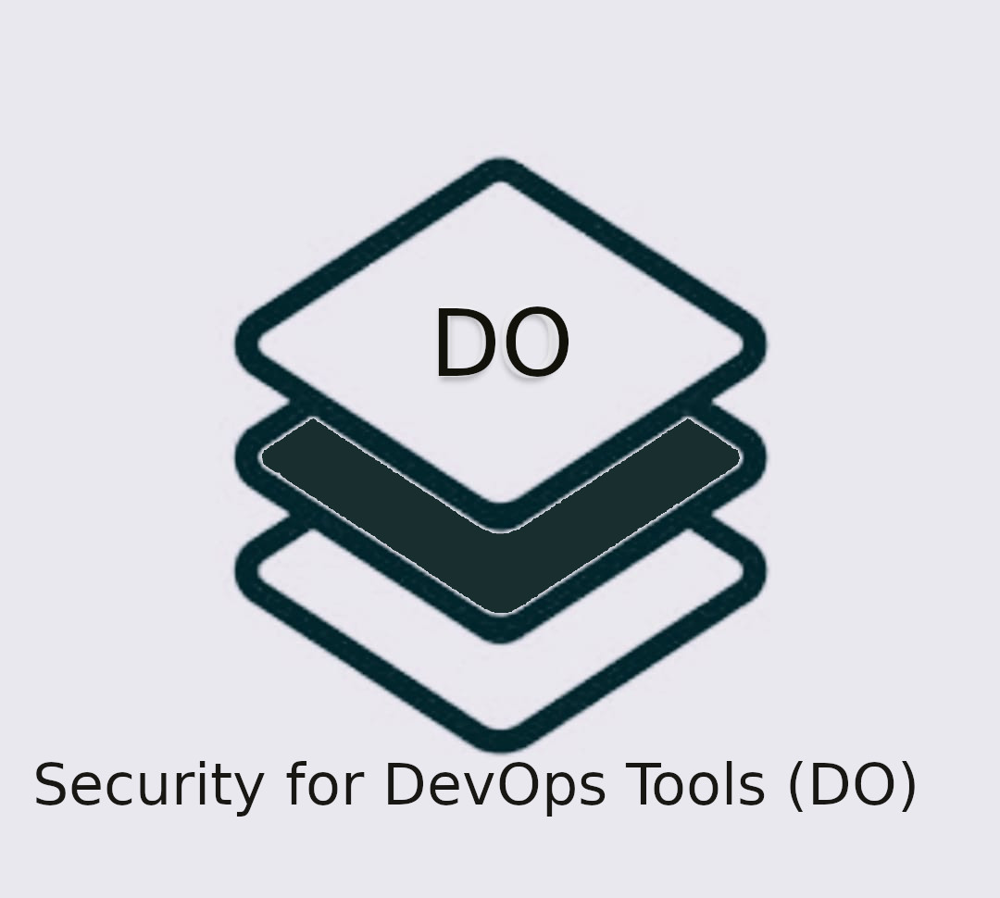
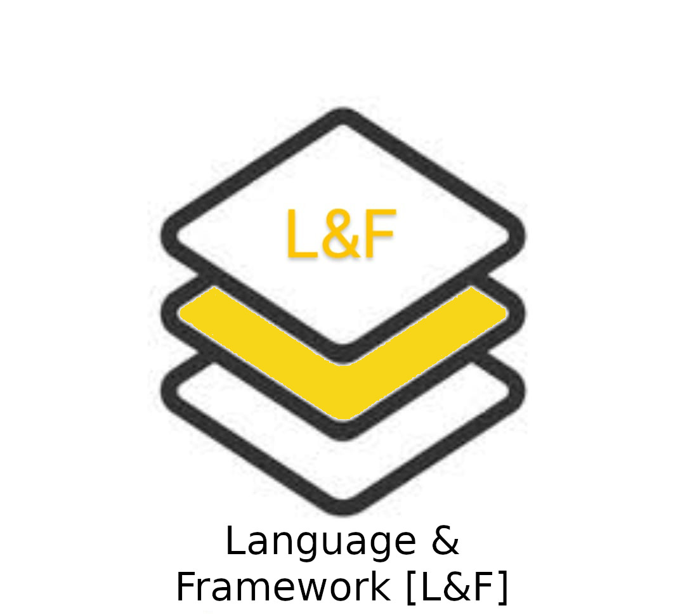
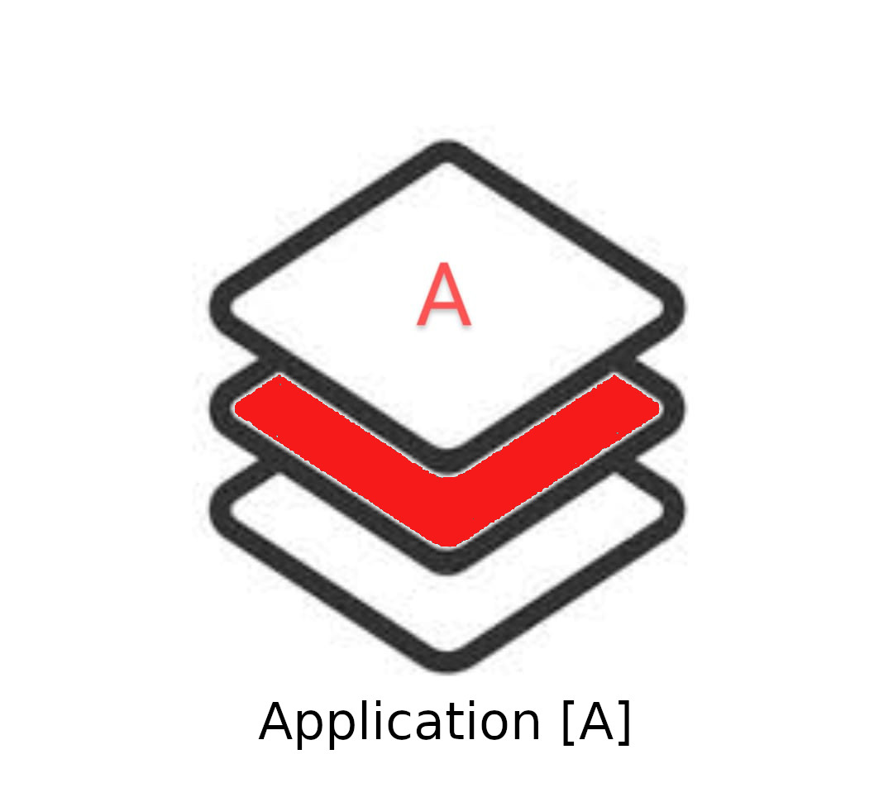
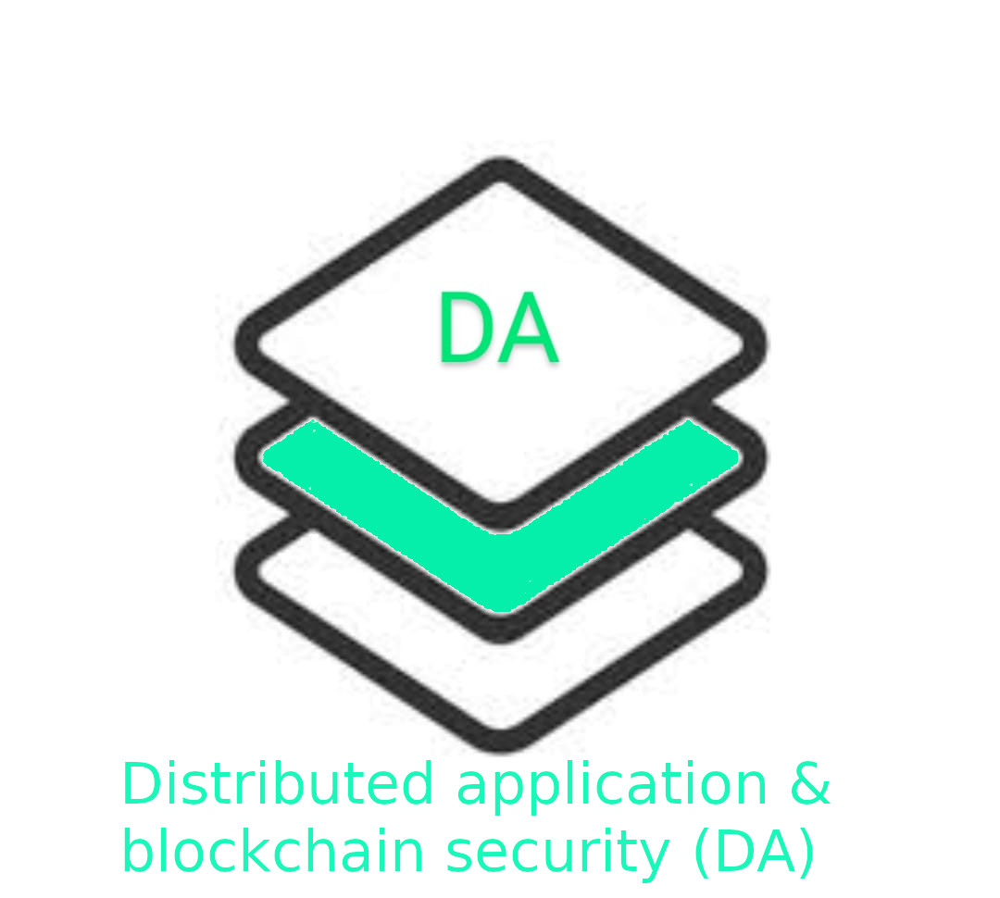
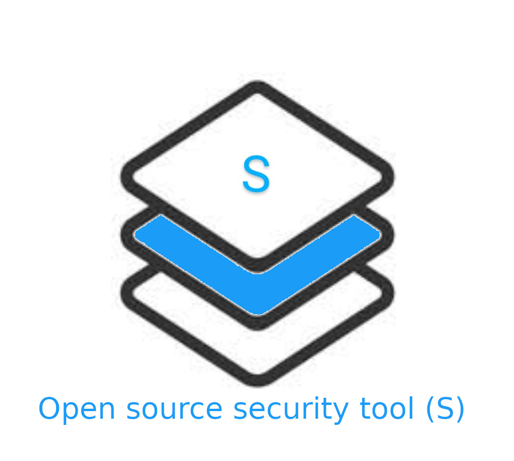

## Be-Secure

Be Secure is an umbrella of open source security project.

#### Why Be-Secure

Open source is the way forward to develop new capabilities through collaboration with open source community projects. Organizations have realized the benefits from open source software. This realization has led them to increase their adoption of open source projects to build business capabilities. This approach necessitates the focus on security for open source projects. Be-Secure projects focus on addressing common security requirements of open source projects. 

#### Who is Be-Secure for –

Organisations, open source developers, security researchers, auditors, and regulators can all benefit from Be-Secure.

#### TAVOSS 

TAVOSS is Trusted And Verified Open Source software that has undergone a security assessment by the Be-Secure Community.

#### Be-Secure Development and Security Assessment Environments

Open source is vast and we have frequent new releases ,bug fixes and patches published every day . It is impossible for any organization to keep track of all the changes that happen across the open source landscape . Hence we have identified five Be-Secure Open source tech stacks or blue prints which we call as Be-Secure environments to help the Be-Secure community navigate through security assessment of these open source projects. 

The open source projects are categorized based on  purpose,interoperability and technology ,They include other open source dependencies that are most frequently required to develop enterprise grade open source solutions.

Each Be-Secure technology stack will be associated with atleast two types of BeSman environments namely the Development or Provisioning environment [Dev] as well as the security testing or security sandbox environment [Sec].

#### Be-Secure Open Source Technology stacks are –

* [DevOps [DO]](./docs/bes-devops-tech-stack.md) 
 

* [Language and framework [L&F]](./docs/bes-lang-framework-tech-stack.md)  
 

* [Application [A]](./docs/bes-app-tech-stack.md) 
 

* [Distributed & Decentralized Application [DA]](./docs/bes-dist-decent-tech-stack.md) 
 

* [Open-source Security Tool [S]](./docs/bes-open-source-security-tool-tech-stack.md) 
 

#### Benefits from Be-Secure –

Developers can easily learn secure development practices and are proactively guided by BeSman environments to apply those practices and automatically informed when action is needed to prevent, remediate, or mitigate security issues.

Developers, auditors, and regulators can create new BeSman Environments and easily distribute security policies that are enforced through tooling and automation, providing continuous assurance of the results.

Security assessment environments aid Developers and researchers to identify security issues ,like unintentional vulnerabilities and have this information swiftly flow - backward through the supply chain to someone who can rapidly address the issue.

Be-Secure Community members can provide information and notifications about product defects, mitigations, quality, and supportability and have this information rapidly flow forward across the ecosystem system to all users, and users can rapidly update their software or implement mitigations as appropriate.

#### OSS Project We Track :

[open source security assessement done By Be-secure Community](./projects_we_track.md)

#### OSS Project We Contribute :

[**BeSman**](https://github.com/Be-Secure/BeSman) or Be-Secure Manager of BeSman for short is a command-line utility to provision customized environments for each TAVOSS tech stack known as Be-Secure environments. 

[**oah-bes-vm**](https://github.com/Be-Secure/oah-bes-vm) for easy local deployment of Be-Secure environmens.

[**BeSlighthouse**](https://github.com/Be-Secure/BeSLighthouse) BeSlighthouse is a community dashboard for TAVOSS Components that are security assessed by the Be-Secure community.. 

 

