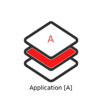

<h1> Application [A] Tech Stack </h1>

This security stack focuses on all open source applications and how they can be secured.

> **Drupal**

| Sl.No  | BeSman Env name                | Dependencies                             |  Entities Prebundled in besman Env                           |
|--------|--------------------------------|------------------------------------------|--------------------------------------------------------------|
| 01     | bes-drupaldev-env              |                                          |  TBD                                                         |
| 02     | bes-drupalsec-env              |                                          |  TBD, bes-appsastsec-env, bes-appdastsec-env, bes-pensec-env |

> **Odoo**

| Sl.No  | BeSman Env name                | Dependencies                             |  Entities Prebundled in besman Env                           |
|--------|--------------------------------|------------------------------------------|--------------------------------------------------------------|
| 01     |  bes-odoodev-env               |                                          | TBD                                                          |
| 02     |  bes-odoosec-env               |                                          | TBD, bes-appsastsec-env, bes-appdastsec-env, bes-pensec-env  |