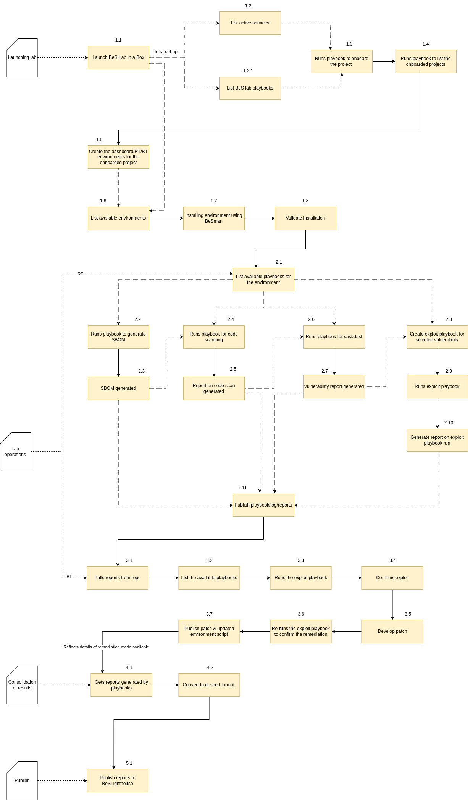

# Be-Secure seven stage security assessment  

 This section describes the seven stages of Be-Secure CE security assessment to enhance the security posture of open source projects / open source tech stacks. 

 Once we receive a request from the community member / user of Be-Secure project to assess an open source tech stack, we will fork the respective open source project into Be-Secure namespace. Then we will commence with our seven stage security assessment as listed below - 

1. First stage: Identification of the blueprint for BeSman environment using the details on the open source tech stack that has been shared. 

2. Second stage: If a suitable blueprint doesn’t exist, build a new BeSman environment. This will be the base environment to perform development activities for the shared open source tech stack. 

3. Third stage: Build the security testing environment/sandbox that can be utilized for conducting security testing for the specific open source tech stack. 

4. Fourth stage: Conduct security assessment and identify the vulnerabilities in it. This vulnerability information will be published. 

5. Fifth stage: Identify and develop security patches for the identified vulnerabilities. 

6. Sixth stage: Upgrade the respective BeSman environments with the confirmed new security patches to strengthen their security posture. Publish the upgraded BeSman environments for active consumption 

7. Seventh stage: For an existing BeSman environment, the focus is on identifying the latest security vulnerabilities and mapping it to the respective environment. This is a continuous activity that is focused on enhancing the security posture of BeSman environments to address the latest identified vulnerabilities. 

# BeS Lab - An Open Source Security Lab 

The lab is designed to deliver enterprise grade trusted and verified open source software (TAVOSS) and customized open source security services.

Objective of Open Source Security Lab:

1. Perform open source and security compliance checks.
2. Generate Trusted And Verified Open Source Software (TAVOSS) components.
3. Customizing security environments for performing security testing activities.
4. Generating security assets to perform open source security testing in an efficient manner.
4. Perform continuous fuzzing of onboarded projects to identify and publish inherent vulnerabilities.

## Provisioning of Open Source Security Lab

### Lab in a Box (LiB)

For easy consumption by any open source community member/ open source security specialist to conduct security assessment activities. The lab services will be hosted on the resources owned by the security specialist.

