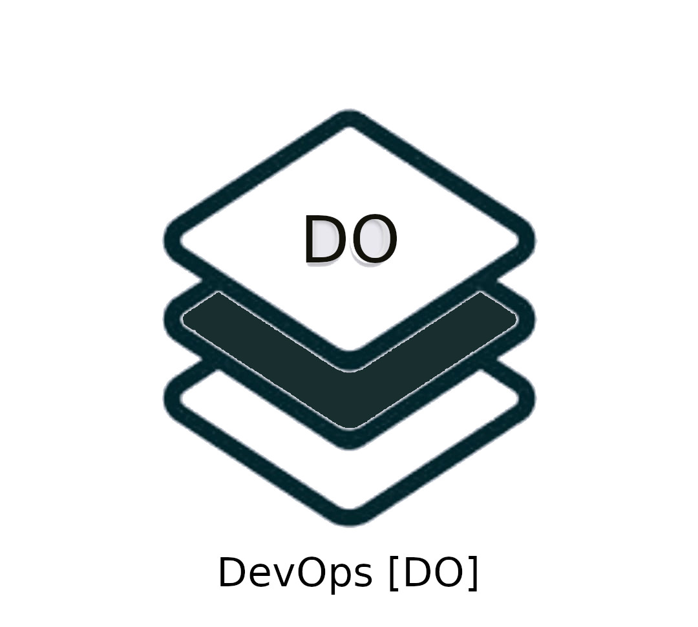
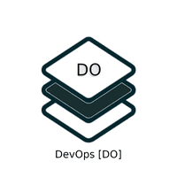

<h1> DevOps and Infrastructure Tools [DO] Tech Stack </h1>

<!--  -->

This security stack focuses on all kinds of open source tools used in DevOps and how they can be secured both in terms of it source code and its implementation. This would enable users to implement DevSecOps using secured DevOps tools. The identified DevOps tools will be assessed for security vulnerabilities and remediated.

 >   **Ansible**

| Sl.No  | BeSman Env name                | Dependencies                             |   Entities Prebundled in besman Env                    |
|--------|--------------------------------|------------------------------------------|--------------------------------------------------------|
| 01     | bes-ansibledev-env             | Python, Ruby, bash, ansible-galaxy       |   Git, Python, Pypi, VScode, Jenkin, Ansible-galaxy    |
| 02     | bes-ansiblesec-env             |                                          |   Java, Jenkin, bes-appsastsec-env, Python, Pypi       |

 >  **Chef**

| Sl.No  | BeSman Env name                | Dependencies                             |  Entities Prebundled in besman Env                     |
|--------|--------------------------------|------------------------------------------|--------------------------------------------------------|
| 01     | bes-chefdev-env                | Ruby (client) and Ruby / Erlang (server) |  Git, RVM, Ruby, Erlang, VSCode, ChefSpec, Jenkin      |
| 02     | bes-chefsec-env                |                                          |  Git, RVM, bes-appsastsec-env, bes-appdastsec-env      |
