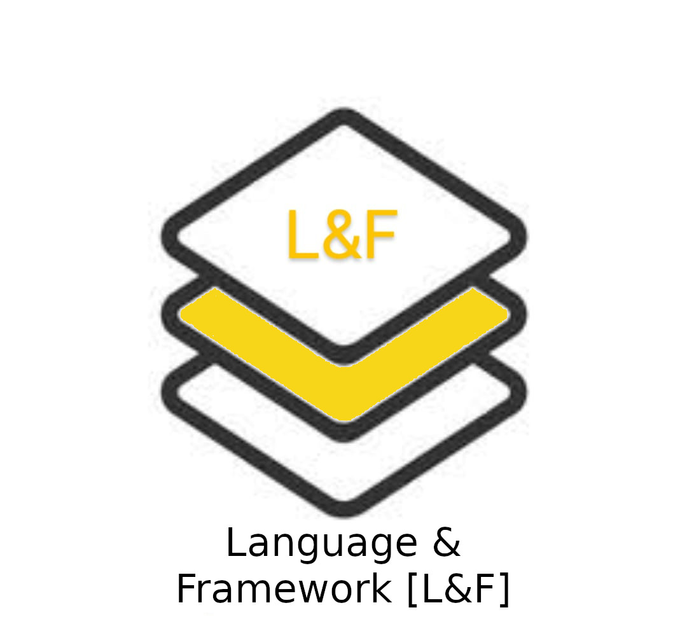
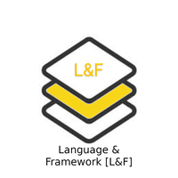

<h1> Language & framework [L&F] Tech Stack </h1>

<!--  -->

<!--  -->

This security stack focuses on all open source programming languages and its associated frameworks that are used to build various applications. These programming languages will be assessed and their vulnerabilities remediated.

>  **Python-Django**

| Sl.No  | BeSman Env name                | Dependencies                             |  Entities Prebundled in besman Env                     |
|--------|--------------------------------|------------------------------------------|--------------------------------------------------------|
| 01     | bes-pythonDjangodev-env        |                                          |  Git, Python, VSCode, pytest, jenkins                  |
| 02     | bes-pythonDjangosec-env        |                                          |  Git, bes-appsastsec-env, bes-pensec-env, Pypi, Python |

>   **Java-Spring**

| Sl.No  | BeSman Env name                | Dependencies                             |  Entities Prebundled in besman Env                     |
|--------|--------------------------------|------------------------------------------|--------------------------------------------------------|
| 01     | bes-javaSpringdev-env          |                                          |  Git, openJDK, Apache Maven, Junit, Selenium, Jenkins  |
| 02     | bes-javaSpringsec-env          |                                          |  Git, openJDK, bes-appsastsec-env, bes-pensec-env,     |
