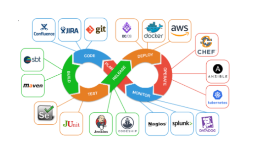

## Current Software Development life cycle

&nbsp;&nbsp;

SDLC is a process followed for a software project, within a software organization. It consists of a detailed plan describing how to develop, maintain, replace and alter or enhance specific software. The life cycle defines a methodology for improving the quality of software and the overall development process.

## Future Development life cycle.

Research and analysis are ongoing on this topic. TBD