<b> As part of the Be-Secure project, the community will be tracking the following projects –</b>

 

<h2><b>Hyperledger Fabric</b></h2>
  
<b>Blockchain solutions | DA</b>

Hyperledger Fabric delivers a uniquely elastic and extensible architecture, distinguishing it from alternative blockchain solutions. Planning for the future of enterprise blockchain requires building on top of a fully-vetted, open source architecture; Hyperledger Fabric is your starting point. This project is an Active Hyperledger project. Hyperledger Fabric is a platform for distributed ledger solutions, underpinned by a modular architecture delivering high degrees of confidentiality, resiliency, flexibility and scalability. It is designed to support pluggable implementations of different components, and accommodate the complexity and intricacies that exist across the economic ecosystem.

<a href="https://github.com/Be-Secure/fabric"> LEARN MORE >> </a>

<h2><b>Hyperledger Indy</b></h2>
  
<b>Blockchain solutions | DA</b>

This is the official SDK for Hyperledger Indy, which provides a distributed-ledger-based foundation for self-sovereign identity. Indy provides a software ecosystem for private, secure, and powerful identity, and the Indy SDK enables clients for it. The major artifact of the SDK is a C-callable library; there are also convenience wrappers for various programming languages and Indy CLI tool. All bugs, stories, and backlog for this project are managed through Hyperledger's Jira in project IS (note that regular Indy tickets are in the INDY project instead.)

<a href="https://github.com/Be-Secure/indy-sdk"> LEARN MORE >> </a>

<h2><b>Hyperledger BESU</b></h2>
  
<b>Blockchain solutions | DA</b>

Besu is an Apache 2.0 licensed, MainNet compatible, Ethereum client written in Java.

<a href="https://github.com/Be-Secure/besu"> LEARN MORE >> </a>

<h2><b>Hyperledger Sawtooth</b></h2>
  
<b>Blockchain solutions | DA</b>

Hyperledger Sawtooth is an enterprise solution for building, deploying, and running distributed ledgers (also called blockchains). It provides an extremely modular and flexible platform for implementing transaction-based updates to shared state between untrusted parties coordinated by consensus algorithms.

<a href="https://github.com/Be-Secure/sawtooth-core"> LEARN MORE >> </a>

<h2><b>Hyperledger BURROW</b></h2>
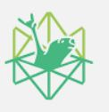  
<b>Blockchain solutions | DA</b>

Hyperledger Burrow is a permissioned Ethereum smart-contract blockchain node. It executes Ethereum EVM and WASM smart contract code (usually written in Solidity) on a permissioned virtual machine. Burrow provides transaction finality and high transaction throughput on a proof-of-stake Tendermint consensus engine.

<a href="https://github.com/Be-Secure/burrow"> LEARN MORE >> </a>

<h2><b>Hyperledger IROHA</b></h2>
  
<b>Blockchain solutions | DA</b>

Iroha is a straightforward distributed ledger technology (DLT), inspired by Japanese Kaizen principle — eliminate excessiveness (muri). Iroha has essential functionality for your asset, information and identity management needs, at the same time being an efficient and trustworthy crash fault-tolerant tool for your enterprise needs.

<a href="https://github.com/Be-Secure/iroha"> LEARN MORE >> </a>

<h2><b>Hyperledger ARIES</b></h2>
  
<b>Blockchain solutions | DA</b>

Hyperledger Aries allows trusted online peer-to-peer interactions based on decentralized identities and verifiable credentials. Aries includes a protocol definition, tools, and reference implementations. The Aries protocol supports identities rooted in a variety of distributed ledgers or blockchains. This approach to identity is often called Self Soverign Identity (SSI).

<a href="https://github.com/Be-Secure/aries"> LEARN MORE >> </a>

<h2><b>Hyperledger CACTUS</b></h2>
  
<b>Blockchain solutions | DA</b>

Hyperledger Cactus aims to provide Decentralized, Secure and Adaptable Integration between Blockchain Networks. Hyperledger Cactus is currently undergoing a major refactoring effort to enable the desired to-be architecture which will enable plug-in based collaborative development to increase the breadth of use cases & Ledgers supported.

<a href="https://github.com/Be-Secure/cactus"> LEARN MORE >> </a>

<h2><b>Hyperledger CELLO</b></h2>
  
<b>Blockchain solutions | DA</b>

Hyperledger Cello is a blockchain provision and operation system, which helps manage blockchain networks in an efficient way.

<a href="https://github.com/Be-Secure/cello"> LEARN MORE >> </a>

<h2><b>Hyperledger CALIPER</b></h2>
  
<b>Blockchain solutions | DA</b>

Caliper is a blockchain performance benchmark framework, which allows users to test different blockchain solutions with predefined use cases, and get a set of performance test results.

<a href="https://github.com/Be-Secure/caliper"> LEARN MORE >> </a>

<h2><b>DefectDojo</b></h2>
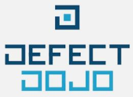  
<b> Vulnerability management tool | S </b>

DefectDojo is a security program and vulnerability management tool. DefectDojo allows you to manage your application security program, maintain product and application information, triage vulnerabilities and push findings into defect trackers.

<a href="https://github.com/Be-Secure/django-DefectDojo"> LEARN MORE >> </a>

<h2><b>OWASP Zed Attack Proxy</b></h2>
  
<b>security tool | S</b>

The OWASP Zed Attack Proxy (ZAP) is one of the world’s most popular free security tools and is actively maintained by a dedicated international team of volunteers. It can help you automatically find security vulnerabilities in your web applications while you are developing and testing your applications. It's also a great tool for experienced pentesters to use for manual security testing

<a href="https://github.com/Be-Secure/zaproxy"> LEARN MORE >> </a>

<h2><b>BeEF</b></h2>
  
<b>Browser Exploitation Framework | S</b>

BeEF is short for The Browser Exploitation Framework. It is a penetration testing tool that focuses on the web browser.

<a href="https://github.com/Be-Secure/beef"> LEARN MORE >> </a>

<h2><b>OpenDXL Ontology</b></h2>
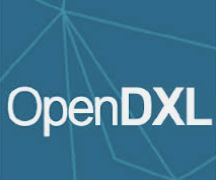  
<b>Interoperable cybersecurity messaging | S </b>

The OpenDXL Ontology project is focused on the development of an open and interoperable cybersecurity messaging format for use with the OpenDXL messaging bus.

<a href="https://github.com/Be-Secure/opendxl-ontology"> LEARN MORE >> </a>

<h2><b>CS-Suite</b></h2>
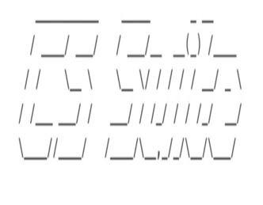  
<b> AWS infrastructure auditing tool  | S </b>

CS Suite is a one stop tool for auditing the security posture of the AWS infrastructure and does system audits as well. CS Suite leverages current open source tools capabilities and has other missing checks added into one tool to rule them all.

<a href="https://github.com/Be-Secure/cs-suite"> LEARN MORE >> </a>

<h2><b>STIX-shifter</b></h2>
<!--    -->
<b>Python library | S </b>

STIX-shifter is an open source python library allowing software to connect to products that house data repositories by using STIX Patterning, and return results as STIX Observations

<a href="https://github.com/Be-Secure/stix-shifter"> LEARN MORE >> </a>

<h2><b>openscap</b></h2>
  
<b>SCAP document scanner | S</b>

The oscap program is a command line tool that allows users to load, scan, validate, edit, and export SCAP documents.

<a href="https://github.com/Be-Secure/openscap"> LEARN MORE >> </a>

<h2><b>fuzzbench</b></h2>
<!--    -->
<b>Fuzzing research evaluator | S</b>

FuzzBench is a free service that evaluates fuzzers on a wide variety of real-world benchmarks, at Google scale. The goal of FuzzBench is to make it painless to rigorously evaluate fuzzing research and make fuzzing research easier for the community to adopt.

<a href="https://github.com/Be-Secure/fuzzbench"> LEARN MORE >> </a>

<h2><b>ghidra</b></h2>
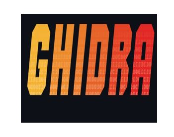  
<b>Software reverse engineering (SRE) framework | S </b>

Ghidra is a software reverse engineering (SRE) framework created and maintained by the National Security Agency Research Directorate. This framework includes a suite of full-featured, high-end software analysis tools that enable users to analyze compiled code on a variety of platforms including Windows, macOS, and Linux. Capabilities include disassembly, assembly, decompilation, graphing, and scripting, along with hundreds of other features.

<a href="https://github.com/Be-Secure/ghidra"> LEARN MORE >> </a>

<h2><b>differential-privacy</b></h2>
<!--    -->
<b>Repository tool | S </b>

This repository contains libraries to generate ε- and (ε, δ)-differentially private statistics over datasets

<a href="https://github.com/Be-Secure/differential-privacy"> LEARN MORE >> </a>

<h2><b>Syncope</b></h2>
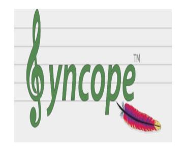  
<b>Digital identity manager | S </b>

Apache Syncope is an Open Source system for managing digital identities in enterprise environments, implemented in Java EE technology and released under Apache 2.0 license.

<a href="https://github.com/Be-Secure/syncope"> LEARN MORE >> </a>

<h2><b>pritunl-zero</b></h2>
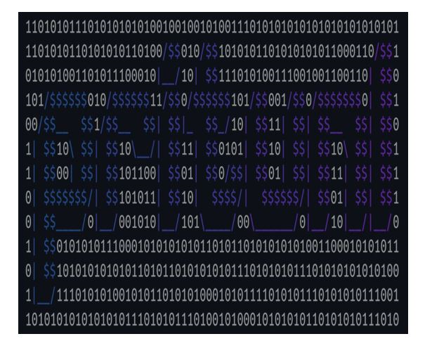  
<b>Authentication system | S </b>

Pritunl-Zero is a zero trust system that provides secure authenticated access to internal services from untrusted networks without the use of a VPN.

<a href="https://github.com/Be-Secure/pritunl-zero"> LEARN MORE >> </a>

<h2><b>Pacu</b></h2>
  
<b>AWS exploitation framework | S </b>

Pacu is an open-source AWS exploitation framework, designed for offensive security testing against cloud environments. Created and maintained by Rhino Security Labs, Pacu allows penetration testers to exploit configuration flaws within an AWS account, using modules to easily expand its functionality.

<a href="https://github.com/Be-Secure/pacu"> LEARN MORE >> </a>

<h2><b>Nmap</b> 

</b></h2>
  
<b>Network scanner | S </b>

Nmap is released under a custom license, which is based on (but not compatible with) GPLv2. The Nmap license allows free usage by end users, and we also offer a commercial license for companies that wish to redistribute Nmap technology with their products.

<a href="https://github.com/Be-Secure/nmap"> LEARN MORE >> </a>

<h2><b>TRASA</b></h2>
<!--    -->
<b>Access control | S </b>

TRASA is a unified access control platform with identity-aware access proxy, privileged access management, two-factor authentication, device trust, and access policy features that enable secure remote access to Web, SSH, RDP, and Database services

<a href="https://github.com/Be-Secure/trasa"> LEARN MORE >> </a>

<h2><b>Kestrel</b></h2>
<!--    -->
<b>Web server | A </b>

Kestrel threat hunting language provides an abstraction for threat hunters to focus on what to hunt instead of how to hunt. The abstraction makes it possible to codify resuable hunting knowledge in a composable and sharable manner. 

<a href="https://github.com/Be-Secure/kestrel-lang"> LEARN MORE >> </a>

<h2><b>Snort</b></h2>
<!--    -->
<b>Intrusion Prevention System | S </b>

Snort 3 is the next generation Snort IPS (Intrusion Prevention System). This file will show you what Snort++ has to offer and guide you through the steps from download to demo

<a href="https://github.com/Be-Secure/snort3"> LEARN MORE >> </a>

<h2><b>CSET</b></h2>
  
<b>Security Evaluation Tool | S </b>

The Cyber Security Evaluation Tool (CSET®) is a Department of Homeland Security (DHS) product that assists organizations in protecting their key national cyber assets. It was developed by cybersecurity experts under the direction of CISA. The tool provides users with a systematic and repeatable approach to assessing the security posture of their cyber systems and networks

<a href="https://github.com/Be-Secure/cset"> LEARN MORE >> </a>

<h2><b>Malcolm</b></h2>
  
<b>Network analyzer | S </b>

Malcolm is a powerful network traffic analysis tool suite

<a href="https://github.com/Be-Secure/Malcolm"> LEARN MORE >> </a>

<h2><b>CTI</b></h2>
<!--    -->
<b>Repository tool | S </b>

This repository contains the MITRE ATT&CK® and CAPEC™ datasets expressed in STIX 2.0. See USAGE or USAGE-CAPEC for information on using this content with python-stix2.

<a href="https://github.com/Be-Secure/cti"> LEARN MORE >> </a>

<h2><b>OSSEC</b></h2>
<!--    -->
<b>Platform for monitor | S </b>

OSSEC is a full platform to monitor and control your systems. It mixes together all the aspects of HIDS (host-based intrusion detection), log monitoring and SIM/SIEM together in a simple, powerful and open source solution

<a href="https://github.com/Be-Secure/ossec-hids"> LEARN MORE >> </a>

<h2><b>Zeek</b></h2>
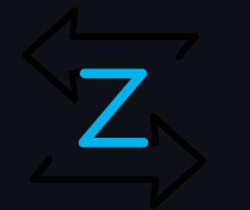  
<b>Network tool | S </b>

A powerful framework for network traffic analysis and security monitoring.

<a href="https://github.com/Be-Secure/zeek"> LEARN MORE >> </a>

<h2><b>Security Onion Solutions</b></h2>
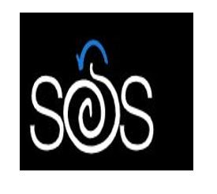  
<b>Security Onion maintainer  | S </b>

Security Onion Solutions, LLC is the creator and maintainer of Security Onion, a free and open platform for threat hunting, network security monitoring, and log management. Security Onion includes best-of-breed free and open tools including Suricata, Zeek, Wazuh, the Elastic Stack and many others

<a href="https://github.com/Be-Secure/securityonion"> LEARN MORE >> </a>

<h2><b>OpenCTI</b></h2>
<!--    -->
<b>Security threat manager  | S </b>

OpenCTI is an open source platform allowing organizations to manage their cyber threat intelligence knowledge and observables. It has been created in order to structure, store, organize and visualize technical and non-technical information about cyber threats.

<a href="https://github.com/Be-Secure/opencti"> LEARN MORE >> </a>

<h2><b>Croc</b></h2>
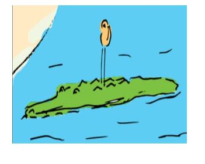  
<b>File transfer | S</b>

croc is a tool that allows any two computers to simply and securely transfer files and folders.

<a href="https://github.com/Be-Secure/croc"> LEARN MORE >> </a>

<h2><b>Security Monkey</b></h2>
  
<b>AWS monitor | S </b>

Security Monkey monitors your AWS and GCP accounts for policy changes and alerts on insecure configurations. Support is available for OpenStack public and private clouds. Security Monkey can also watch and monitor your GitHub organizations, teams, and repositories.

<a href="https://github.com/Be-Secure/security_monkey"> LEARN MORE >> </a>

<h2><b>Scorecard</b></h2>
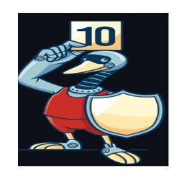  
<b>Automated analyzer | S</b>

Automate analysis and trust decisions on the security posture of open source projects.

<a href="https://github.com/Be-Secure/scorecard"> LEARN MORE >> </a>

<h2><b><h2>Syft</h2>

</b></h2>
<!--    -->
<b>SBOM Generator | S </b>

A CLI tool and go library for generating a Software Bill of Materials (SBOM) from container images and filesystems. Exceptional for vulnerability detection when used with a scanner tool like Grype.

<a href="https://github.com/Be-Secure/syft"> LEARN MORE >> </a>

<h2><b>Grype</b></h2>
<!--    -->
<b>Vulnerability scanner | S</b>

A vulnerability scanner for container images and filesystems. Easily install the binary to try it out. Works with Syft, the powerful SBOM (software bill of materials) tool for container images and filesystems.

<a href="https://github.com/Be-Secure/grype"> LEARN MORE >> </a>

<h2><b>Emmy</b></h2>
  
<b>Protocols Library | S </b>

Emmy is a library for building protocols/applications based on zero-knowledge proofs, for example anonymous credentials. Zero-knowledge proofs are client-server protocols (in crypto terms also prover-verifier, where the prover takes on the role of the client, and the verifier takes on the role of the server) where the client proves a knowledge of a secret without actually revealing the secret

<a href="https://github.com/Be-Secure/emmy"> LEARN MORE >> </a>

<h2><b>Threat Dragon</b></h2>
  
<b>Threat modelling | S</b>

Threat Dragon is a free, open-source, cross-platform threat modelling application including system diagramming and a threat rule engine to auto-generate threats/mitigations. It is an OWASP Incubator Project and follows the values and principles of the threat modeling manifesto. The roadmap for the project is a simple UX, a powerful rule engine and integration with other development lifecycle tools.

<a href="https://github.com/Be-Secure/threat-dragon"> LEARN MORE >> </a>

<h2><b>Trivy</b></h2>
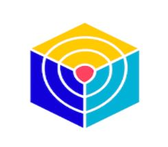  
<b>Vulnerability scan | S </b>

Trivy (tri pronounced like trigger, vy pronounced like envy) is a simple and comprehensive scanner for vulnerabilities in container images, file systems, and Git repositories, as well as for configuration issues. Trivy detects vulnerabilities of OS packages (Alpine, RHEL, CentOS, etc.) and language-specific packages (Bundler, Composer, npm, yarn, etc.). In addition, Trivy scans Infrastructure as Code (IaC) files such as Terraform, Dockerfile and Kubernetes, to detect potential configuration issues that expose your deployments to the risk of attack.

<a href="https://github.com/Be-Secure/trivy"> LEARN MORE >> </a>

<h2><b>OWASP Glue</b></h2>
  
<b>Framework for Security tools | S </b>

Glue is a framework for running a series of tools. Generally, it is intended as a backbone for automating a security analysis pipeline of tools.

<a href="https://github.com/Be-Secure/glue"> LEARN MORE >> </a>

<h2><b>ModSecurity</b></h2>
  
<b>Interface for ModSecurity Connectors | S </b>

Libmodsecurity is one component of the ModSecurity v3 project. The library codebase serves as an interface to ModSecurity Connectors taking in web traffic and applying traditional ModSecurity processing. In general, it provides the capability to load/interpret rules written in the ModSecurity SecRules format and apply them to HTTP content provided by your application via Connectors.

<a href="https://github.com/Be-Secure/ModSecurity"> LEARN MORE >> </a>

<h2><b>Archery</b></h2>
  
<b>Vulnerability assessment/management | S </b>

Archery is an opensource vulnerability assessment and management tool which helps developers and pentesters to perform scans and manage vulnerabilities. Archery uses popular opensource tools to perform comprehensive scanning for web application and network. It also performs web application dynamic authenticated scanning and covers the whole applications by using selenium. The developers can also utilize the tool for implementation of their DevOps CI/CD environment.

<a href="https://github.com/Be-Secure/archerysec"> LEARN MORE >> </a>

<h2><b>Trellis</b></h2>
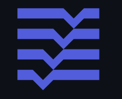  
<b></b>

Trellis is an open source project and completely free to use.

However, the amount of effort needed to maintain and develop new features and products within the Roots ecosystem is not sustainable without proper financial backing.

<a href="https://github.com/Be-Secure/trellis"> LEARN MORE >> </a>

<h2><b>GitLab-foss</b></h2>
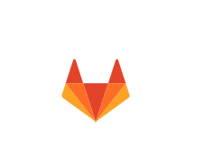  
<b></b>

GitLab FOSS is a read-only mirror of GitLab, with all proprietary code removed. This project was previously used to host GitLab Community Edition, but all development has now moved to https://gitlab.com/gitlab-org/gitlab.

<a href="https://github.com/Be-Secure/gitlab-foss"> LEARN MORE >> </a>

<h2><b>GitLabhq</b></h2>
  
<b></b>

GitLab CE Mirror | Please open new issues in our issue tracker on GitLab.com

<a href="https://github.com/Be-Secure/gitlabhq"> LEARN MORE >> </a>

<h2><b>Molecule</b></h2>
<!--    -->
<b></b>

Molecule project is designed to aid in the development and testing of Ansible roles.

Molecule provides support for testing with multiple instances, operating systems and distributions, virtualization providers, test frameworks and testing scenarios.

Molecule encourages an approach that results in consistently developed roles that are well-written, easily understood and maintained.

<a href="https://github.com/Be-Secure/molecule"> LEARN MORE >> </a>

<h2><b>Server</b></h2>
  
<b></b>

MariaDB was designed as a drop-in replacement of MySQL(R) with more features, new storage engines, fewer bugs, and better performance.

MariaDB is brought to you by the MariaDB Foundation and the MariaDB Corporation. Please read the CREDITS file for details about the MariaDB Foundation, and who is developing MariaDB.

MariaDB is developed by many of the original developers of MySQL who now work for the MariaDB Corporation, the MariaDB Foundation and by many people in the community.

<a href="https://github.com/Be-Secure/server"> LEARN MORE >> </a>

<h2><b>Meta-ros</b></h2>
<!--    -->
<b></b>

As of Milestone 16 (2021-06-24), this branch can be used to build the releases current at the end of June 2021 of ROS 2 dashing, eloquent, foxy, galactic, and rolling and ROS 1 melodic and noetic with the honister OpenEmbedded release series.

The original implementation of meta-ros for ROS 1 Indigo Igloo (https://github.com/bmwcarit/meta-ros) was transferred here on 2019-06-25. It has been converted to use recipes generated by superflore. 

<a href="https://github.com/Be-Secure/meta-ros"> LEARN MORE >> </a>

<h2><b>Lightning</b></h2>
<!--    -->
<b></b>

Lightning is a (TV) app development framework that offers great portability and performance.

<a href="https://github.com/Be-Secure/Lightning"> LEARN MORE >> </a>

<h2><b>Moodle</b></h2>
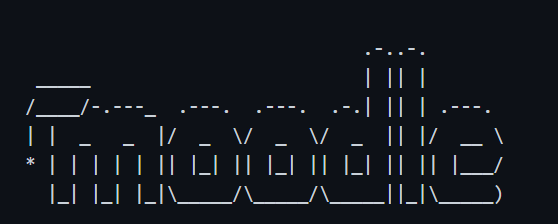  
<b></b>

Moodle - the world's open source learning platform

Moodle <https://moodle.org> is a learning platform designed to provide
educators, administrators and learners with a single robust, secure and
integrated system to create personalised learning environments.

You can download Moodle <https://download.moodle.org> and run it on your own
web server, ask one of our Moodle Partners <https://moodle.com/partners/> to
assist you, or have a MoodleCloud site <https://moodle.com/cloud/> set up for
you.

Moodle is widely used around the world by universities, schools, companies and
all manner of organisations and individuals.

<a href="https://github.com/Be-Secure/moodle"> LEARN MORE >> </a>

<h2><b>Odoo</b></h2>
  
<b></b>

Odoo is a suite of web based open source business apps.

The main Odoo Apps include an Open Source CRM, Website Builder, eCommerce, Warehouse Management, Project Management, Billing & Accounting, Point of Sale, Human Resources, Marketing, Manufacturing, ...

Odoo Apps can be used as stand-alone applications, but they also integrate seamlessly so you get a full-featured Open Source ERP when you install several Apps.

<a href="https://github.com/Be-Secure/odoo"> LEARN MORE >> </a>

