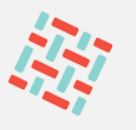
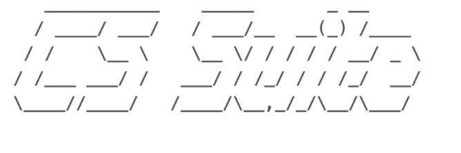
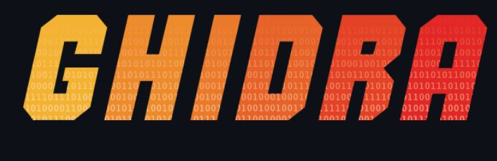
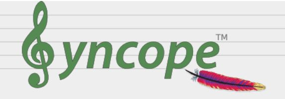
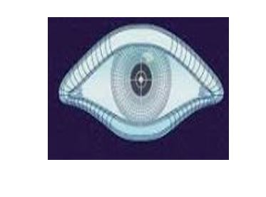
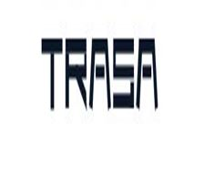
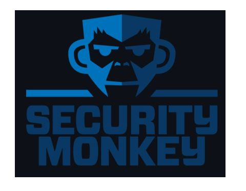
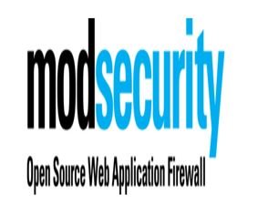

<b> As part of the Be-Secure project, the community will be tracking the following projects –</b>

 

  
<h2>Hyperledger Fabric</h2> 

Hyperledger Fabric delivers a uniquely elastic and extensible architecture, distinguishing it from alternative blockchain solutions. Planning for the future of enterprise blockchain requires building on top of a fully-vetted, open source architecture; Hyperledger Fabric is your starting point.
 <a href="https://github.com/Be-Secure/fabric "><right>LEARN MORE</right></a>

  
<h2>Hyperledger Indy</h2> 

This is the official SDK for Hyperledger Indy, which provides a distributed-ledger-based foundation for self-sovereign identity. Indy provides a software ecosystem for private, secure, and powerful identity, and the Indy SDK enables clients for it. The major artifact of the SDK is a C-callable library; there are also convenience wrappers for various programming languages and Indy CLI tool.
 <a href="https://github.com/Be-Secure/indy-sdk "><right>LEARN MORE</right></a>

  
<h2>Hyperledger Sawtooth</h2> 

Hyperledger Sawtooth is an enterprise solution for building, deploying, and running distributed ledgers (also called blockchains). It provides an extremely modular and flexible platform for implementing transaction-based updates to shared state between untrusted parties coordinated by consensus algorithms.
 <a href="https://github.com/Be-Secure/sawtooth-core  "><right>LEARN MORE</right></a>

  
<h2>Hyperledger BESU</h2> 

Besu is an Apache 2.0 licensed, MainNet compatible, Ethereum client written in Java.
 <a href="https://github.com/Be-Secure/besu "><right>LEARN MORE</right></a>

  
<h2>Hyperledger BURROW</h2> 

Hyperledger Burrow is a permissioned Ethereum smart-contract blockchain node. It executes Ethereum EVM and WASM smart contract code (usually written in Solidity) on a permissioned virtual machine. Burrow provides transaction finality and high transaction throughput on a proof-of-stake Tendermint consensus engine.
 <a href="https://github.com/Be-Secure/burrow "><right>LEARN MORE</right></a>

  
<h2>Hyperledger IROHA</h2> 

Iroha is a straightforward distributed ledger technology (DLT), inspired by Japanese Kaizen principle — eliminate excessiveness (muri). Iroha has essential functionality for your asset, information and identity management needs, at the same time being an efficient and trustworthy crash fault-tolerant tool for your enterprise needs.
 <a href="https://github.com/Be-Secure/iroha "><right>LEARN MORE</right></a>

  
<h2>Hyperledger ARIES</h2> 

Hyperledger Aries allows trusted online peer-to-peer interactions based on decentralized identities and verifiable credentials. Aries includes a protocol definition, tools, and reference implementations. The Aries protocol supports identities rooted in a variety of distributed ledgers or blockchains. This approach to identity is often called Self Soverign Identity (SSI).
 <a href="https://github.com/Be-Secure/aries "><right>LEARN MORE</right></a>

  
<h2>Hyperledger CACTUS</h2> 

Hyperledger Cactus aims to provide Decentralized, Secure and Adaptable Integration between Blockchain Networks. Hyperledger Cactus is currently undergoing a major refactoring effort to enable the desired to-be architecture which will enable plug-in based collaborative development to increase the breadth of use cases & Ledgers supported.
 <a href="https://github.com/Be-Secure/cactus "><right>LEARN MORE</right></a>

  
<h2>Hyperledger CELLO</h2> 

Hyperledger Cello is a blockchain provision and operation system, which helps manage blockchain networks in an efficient way.
 <a href="https://github.com/Be-Secure/cello "><right>LEARN MORE</right></a>

  
<h2>Hyperledger CALIPER</h2>

Caliper is a blockchain performance benchmark framework, which allows users to test different blockchain solutions with predefined use cases, and get a set of performance test results.
 <a href="https://github.com/Be-Secure/caliper "><right>LEARN MORE</right></a>

  
<h2>DefectDojo</h2>

DefectDojo is a security program and vulnerability management tool. DefectDojo allows you to manage your application security program, maintain product and application information, triage vulnerabilities and push findings into defect trackers.
 <a href="https://github.com/Be-Secure/django-DefectDojo "><right>LEARN MORE</right></a>

  
<h2>OWASP Zed Attack Proxy</h2> 

The OWASP Zed Attack Proxy (ZAP) is one of the world’s most popular free security tools and is actively maintained by a dedicated international team of volunteers. It can help you automatically find security vulnerabilities in your web applications while you are developing and testing your applications. It's also a great tool for experienced pentesters to use for manual security testing
 <a href="https://github.com/Be-Secure/zaproxy "><right>LEARN MORE</right></a>

  
<h2>BeEF</h2> 

BeEF is short for The Browser Exploitation Framework. It is a penetration testing tool that focuses on the web browser.
 <a href="https://github.com/Be-Secure/beef "><right>LEARN MORE</right></a>

  
<h2>OpenDXL Ontology</h2>

The OpenDXL Ontology project is focused on the development of an open and interoperable cybersecurity messaging format for use with the OpenDXL messaging bus. 
 <a href="https://github.com/Be-Secure/opendxl-ontology "><right>LEARN MORE</right></a>

  
<h2>CS-Suite</h2> 

CS Suite is a one stop tool for auditing the security posture of the AWS infrastructure and does system audits as well. CS Suite leverages current open source tools capabilities and has other missing checks added into one tool to rule them all.
 <a href="https://github.com/Be-Secure/cs-suite "><right>LEARN MORE</right></a>

<!--    -->
<h2>STIX-shifter </h2>

STIX-shifter is an open source python library allowing software to connect to products that house data repositories by using STIX Patterning, and return results as STIX Observations.
 <a href="https://github.com/Be-Secure/stix-shifter" style="text-align:right;">LEARN MORE</a>

  
<h2>openscap</h2>

The oscap program is a command line tool that allows users to load, scan, validate, edit, and export SCAP documents.
 <a href="https://github.com/Be-Secure/openscap"><right>LEARN MORE</right></a>

<!--    -->
<h2>fuzzbench</h2>

FuzzBench is a free service that evaluates fuzzers on a wide variety of real-world benchmarks, at Google scale. The goal of FuzzBench is to make it painless to rigorously evaluate fuzzing research and make fuzzing research easier for the community to adopt.
 <a href="https://github.com/Be-Secure/fuzzbench"><right>LEARN MORE</right></a>

  
<h2>ghidra</h2> 

Ghidra is a software reverse engineering (SRE) framework created and maintained by the National Security Agency Research Directorate. This framework includes a suite of full-featured, high-end software analysis tools that enable users to analyze compiled code on a variety of platforms including Windows, macOS, and Linux. Capabilities include disassembly, assembly, decompilation, graphing, and scripting, along with hundreds of other features.
 <a href="https://github.com/Be-Secure/ghidra"><right>LEARN MORE</right></a>

<!--    -->
<h2>differential-privacy</h2>

This repository contains libraries to generate ε- and (ε, δ)-differentially private statistics over datasets
 <a href="https://github.com/Be-Secure/differential-privacy"><right>LEARN MORE</right></a>

  
<h2>Syncope</h2> 

Apache Syncope is an Open Source system for managing digital identities in enterprise environments, implemented in Java EE technology and released under Apache 2.0 license.
 <a href="https://github.com/Be-Secure/syncope "><right>LEARN MORE</right></a>

  
<h2>pritunl-zero</h2> 

Pritunl-Zero is a zero trust system that provides secure authenticated access to internal services from untrusted networks without the use of a VPN.
 <a href="https://github.com/Be-Secure/pritunl-zero "><right>LEARN MORE</right></a>

  
<h2>Pacu</h2> 

Pacu is an open-source AWS exploitation framework, designed for offensive security testing against cloud environments. Created and maintained by Rhino Security Labs, Pacu allows penetration testers to exploit configuration flaws within an AWS account, using modules to easily expand its functionality.
 <a href="https://github.com/Be-Secure/pacu"><right>LEARN MORE</right></a>

  
<h2>Nmap</h2> 

Nmap is released under a custom license, which is based on (but not compatible with) GPLv2. The Nmap license allows free usage by end users, and we also offer a commercial license for companies that wish to redistribute Nmap technology with their products.
 <a href="https://github.com/Be-Secure/nmap"><right>LEARN MORE</right></a>

<!--    -->
<h2>TRASA</h2>

TRASA is a unified access control platform with identity-aware access proxy, privileged access management, two-factor authentication, device trust, and access policy features that enable secure remote access to Web, SSH, RDP, and Database services.
 <a href="https://github.com/Be-Secure/trasa"><right>LEARN MORE</right></a>

<!--    -->
<h2>Kestrel</h2>

Kestrel threat hunting language provides an abstraction for threat hunters to focus on what to hunt instead of how to hunt. The abstraction makes it possible to codify resuable hunting knowledge in a composable and sharable manner. 
 <a href="https://github.com/Be-Secure/kestrel-lang"><right>LEARN MORE</right></a>

<!--    -->
<h2>Snort</h2>

Snort 3 is the next generation Snort IPS (Intrusion Prevention System). This file will show you what Snort++ has to offer and guide you through the steps from download to demo
 <a href="https://github.com/Be-Secure/snort3"><right>LEARN MORE</right></a>

  
<h2>CSET</h2> 

The Cyber Security Evaluation Tool (CSET®) is a Department of Homeland Security (DHS) product that assists organizations in protecting their key national cyber assets. It was developed by cybersecurity experts under the direction of CISA. The tool provides users with a systematic and repeatable approach to assessing the security posture of their cyber systems and networks
 <a href="https://github.com/Be-Secure/cset"><right>LEARN MORE</right></a>

  
<h2>Malcolm</h2> 

Malcolm is a powerful network traffic analysis tool suite
 <a href="https://github.com/Be-Secure/Malcolm"><right>LEARN MORE</right></a>

<!--    -->
<h2>CTI</h2>

This repository contains the MITRE ATT&CK® and CAPEC™ datasets expressed in STIX 2.0. See USAGE or USAGE-CAPEC for information on using this content with python-stix2.
 <a href="https://github.com/Be-Secure/cti"><right>LEARN MORE</right></a>

<!--    -->
<h2>OSSEC</h2>

OSSEC is a full platform to monitor and control your systems. It mixes together all the aspects of HIDS (host-based intrusion detection), log monitoring and SIM/SIEM together in a simple, powerful and open source solution
 <a href="https://github.com/Be-Secure/ossec-hids"><right>LEARN MORE</right></a>

  
<h2>Zeek</h2>

A powerful framework for network traffic analysis and security monitoring.
 <a href="https://github.com/Be-Secure/zeek "><right>LEARN MORE</right></a>

  
<h2>Security Onion Solutions</h2> 

Security Onion Solutions, LLC is the creator and maintainer of Security Onion, a free and open platform for threat hunting, network security monitoring, and log management. Security Onion includes best-of-breed free and open tools including Suricata, Zeek, Wazuh, the Elastic Stack and many others
 <a href="https://github.com/Be-Secure/securityonion"><right>LEARN MORE</right></a>

<!--    -->
<h2>OpenCTI</h2>

OpenCTI is an open source platform allowing organizations to manage their cyber threat intelligence knowledge and observables. It has been created in order to structure, store, organize and visualize technical and non-technical information about cyber threats.
 <a href="https://github.com/Be-Secure/opencti"><right>LEARN MORE</right></a>

  
<h2>Croc</h2>

croc is a tool that allows any two computers to simply and securely transfer files and folders.
 <a href="https://github.com/Be-Secure/croc"><right>LEARN MORE</right></a>

  
<h2>Security Monkey</h2>

Security Monkey monitors your AWS and GCP accounts for policy changes and alerts on insecure configurations. Support is available for OpenStack public and private clouds. Security Monkey can also watch and monitor your GitHub organizations, teams, and repositories.
 <a href="https://github.com/Be-Secure/security_monkey"><right>LEARN MORE</right></a>

  
<h2>Scorecard</h2> 

Automate analysis and trust decisions on the security posture of open source projects.
 <a href="https://github.com/Be-Secure/scorecard"><right>LEARN MORE</right></a>

<!--    -->
<h2>Syft</h2>

A CLI tool and go library for generating a Software Bill of Materials (SBOM) from container images and filesystems. Exceptional for vulnerability detection when used with a scanner tool like Grype.
 <a href="https://github.com/Be-Secure/syft"><right>LEARN MORE</right></a>

<!--    -->
<h2>Grype</h2>

A vulnerability scanner for container images and filesystems. Easily install the binary to try it out. Works with Syft, the powerful SBOM (software bill of materials) tool for container images and filesystems.
 <a href="https://github.com/Be-Secure/grype"><right>LEARN MORE</right></a>

  
<h2>Emmy</h2> 

Emmy is a library for building protocols/applications based on zero-knowledge proofs, for example anonymous credentials. Zero-knowledge proofs are client-server protocols (in crypto terms also prover-verifier, where the prover takes on the role of the client, and the verifier takes on the role of the server) where the client proves a knowledge of a secret without actually revealing the secret
 <a href="https://github.com/Be-Secure/emmy"><right>LEARN MORE</right></a>

  
<h2>Threat Dragon</h2> 

Threat Dragon is a free, open-source, cross-platform threat modelling application including system diagramming and a threat rule engine to auto-generate threats/mitigations. It is an OWASP Incubator Project and follows the values and principles of the threat modeling manifesto. The roadmap for the project is a simple UX, a powerful rule engine and integration with other development lifecycle tools.
 <a href="https://github.com/Be-Secure/threat-dragon"><right>LEARN MORE</right></a>

  
<h2>Trivy</h2> 

Trivy (tri pronounced like trigger, vy pronounced like envy) is a simple and comprehensive scanner for vulnerabilities in container images, file systems, and Git repositories, as well as for configuration issues. Trivy detects vulnerabilities of OS packages (Alpine, RHEL, CentOS, etc.) and language-specific packages (Bundler, Composer, npm, yarn, etc.). In addition, Trivy scans Infrastructure as Code (IaC) files such as Terraform, Dockerfile and Kubernetes, to detect potential configuration issues that expose your deployments to the risk of attack.
 <a href="https://github.com/Be-Secure/trivy"><right>LEARN MORE</right></a>

  
<h2>OWASP Glue</h2> 

Glue is a framework for running a series of tools. Generally, it is intended as a backbone for automating a security analysis pipeline of tools.
 <a href="https://github.com/Be-Secure/glue"><right>LEARN MORE</right></a>

  
<h2>ModSecurity</h2> 

Libmodsecurity is one component of the ModSecurity v3 project. The library codebase serves as an interface to ModSecurity Connectors taking in web traffic and applying traditional ModSecurity processing. In general, it provides the capability to load/interpret rules written in the ModSecurity SecRules format and apply them to HTTP content provided by your application via Connectors.
 <a href="https://github.com/Be-Secure/ModSecurity"><right>LEARN MORE</right></a>

  
<h2>Archery</h2> 

Archery is an opensource vulnerability assessment and management tool which helps developers and pentesters to perform scans and manage vulnerabilities. Archery uses popular opensource tools to perform comprehensive scanning for web application and network. It also performs web application dynamic authenticated scanning and covers the whole applications by using selenium. The developers can also utilize the tool for implementation of their DevOps CI/CD environment.
 <a href="https://github.com/Be-Secure/archerysec"><right>LEARN MORE</right></a>

