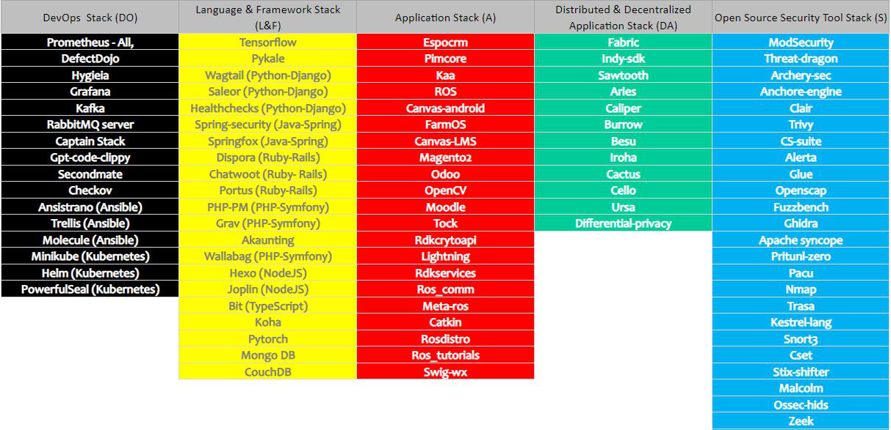

<h1> Be-Secure Open Source Security Tech Stacks: </h1>

 Open source is a vast technology space. We have frequent releases, bug fixes / patches being published very frequently. It is quite a tedious and time consuming effort for an organization to keep track of all changes that happen across the open source software landscape. Hence we have categorised open source technologies into five Be-Secure Open Source security tech stacks or blue prints to help the Be-Secure community navigate through security assessment of open source projects that are part of one of these categories. 

 The open source projects are categorized based on purpose, interoperability and technology. They also include other open source dependencies that are frequently required to develop enterprise grade open source solutions. 

<h4> Be-Secure Open Source Security tech stacks are - </h4>

* [DevOps [DO]](./bes-devops-tech-stack.md) : Be-Secure tech stacks to secure open source devops tools eg. Ansible, Puppet etc.  

* [Language and framework [L&F]](./bes-lang-framework-tech-stack.md): Be-Secure tech stacks to secure language and framework built on generic languages e.g. Ruby & Rails, PHP & Symphony, Python & Django, Javascript & Angular/Node etc.

* [Application [A]](./bes-app-tech-stack.md)  

* [Distributed & Decentralized Application [DA]](./bes-dist-decent-tech-stack.md): Be-Secure tech stacks for distributed and decentralized Distributed application, few e.g. are Blockchain frameworks like Hyperledger Indy, Hyperledger Fabric , Quorum etc. 

* [Open-source Security Tool [S]](./bes-open-source-security-tool-tech-stack.md): Be-Secure tech stacks for open source security tools eg. ZAP, BeEF etc. 

 Each BeSecure tech stack will be associated with two types of BeSman environments namely the Development or Provisioning environment [Dev] as well as the security testing or security sandbox environment [Sec]. 

<h4> BeSecure Environment for Blue teams/Teaming </h4>

 This is a development environment configured for an open source project, pre-bundled with all the required tools and dependencies that would help the developer to perform their development activities which includes adding new features, bug/vulnerability fixing etc. 

This is main area where the issue/vulnerabilities tracked by the Red team will be addressed. 
 

<h4> BeSecure Environment for Red Teams/Teaming </h4>

 This is a security environment configured for an open source project, pre-bundled with all the required tools and dependencies that would help the red team members to perform their security testing activities.

Team will be identify the bugs/related vulnerabilities using various security tools installed in this environment. 
 

The Security assessment report of the tracked project will be updated under [BeSLighthouse](https://be-secure.github.io/BeSLighthouse) project

